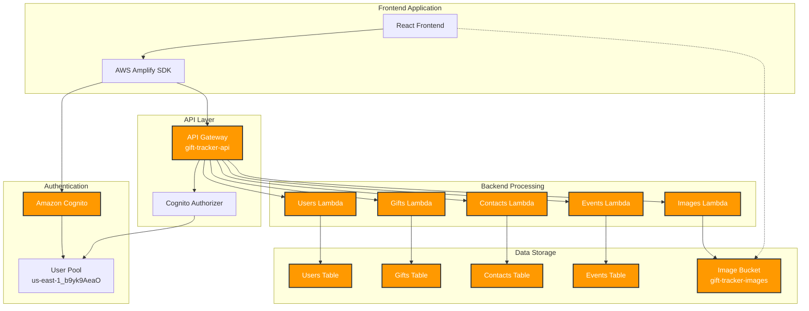

# Gift Tracker System Architecture

## System Overview

The Gift Tracker application uses a serverless architecture built on AWS services. Below is a detailed diagram of how the different components interact.

## Component Details

### Frontend

- **React Frontend**: Main application interface
- **AWS Amplify SDK**: Handles AWS service integration

### Authentication

- **Cognito User Pool**: `us-east-1_b9yk9AeaO`
  - Manages user authentication
  - Handles sign-up/sign-in flows
  - Issues JWT tokens

### API Layer

- **API Gateway**: `https://buaes967sk.execute-api.us-east-1.amazonaws.com/prod`
  - Routes API requests
  - Validates requests
  - Handles CORS
  - Integrates with Cognito authorization

### Lambda Functions

1. **Users Lambda**: Manages user profiles
2. **Gifts Lambda**: Handles gift CRUD operations
3. **Contacts Lambda**: Manages contact information
4. **Events Lambda**: Handles event management
5. **Images Lambda**: Generates S3 pre-signed URLs

### Data Storage

1. **DynamoDB Tables**:

   - `GiftTracker-Users`: User profiles
   - `GiftTracker-Gifts`: Gift records
   - `GiftTracker-Contacts`: Contact information
   - `GiftTracker-Events`: Event data

2. **S3 Bucket**: `gift-tracker-images-147997144209`
   - Stores gift images
   - Direct upload via pre-signed URLs

## Data Flow

### Authentication Flow

1. User initiates login through frontend
2. Amplify SDK communicates with Cognito
3. Cognito validates credentials and issues JWT
4. Token is used for subsequent API calls

### API Request Flow

1. Frontend makes API request with JWT
2. API Gateway validates token with Cognito
3. Request is routed to appropriate Lambda
4. Lambda processes request and interacts with database
5. Response flows back through API Gateway

### Image Upload Flow

1. Frontend requests upload URL from Images Lambda
2. Lambda generates pre-signed S3 URL
3. Frontend uploads directly to S3
4. Image URL is stored with gift record

## Security

- All endpoints require authentication
- CORS is configured for frontend access
- S3 bucket access is controlled via pre-signed URLs
- DynamoDB access is restricted to Lambda functions
- API requests are validated at Gateway level

## Monitoring & Costs

- CloudWatch monitors Lambda execution
- DynamoDB uses on-demand capacity
- S3 lifecycle rules manage storage costs
- API Gateway throttling prevents abuse
